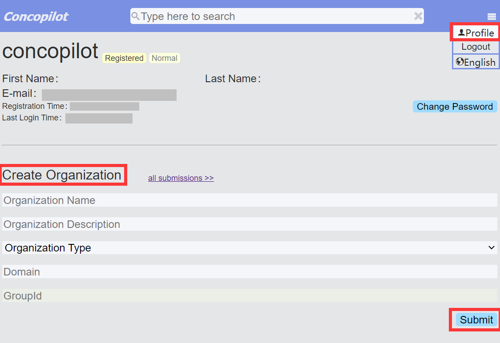

# Apply a Group ID

We use the `group_id` in component management to separate components that developed by different organization to eliminate the component conflict between organizations.

We follow the same requirement of the Java Maven package management.
Check [this](https://central.sonatype.org/publish/requirements/coordinates/) for detail.

We accept both the organization group_id (has an organization domain) and personal group_id (has a personal domain like Git).

Developers can create an organization in their user Profile Page like below:

A domain of the organization should be provided during the creation.
The system will generate a group_id from your domain.

After submit the creation, you can find a ticket with a ticket ID for the submission by clicking the "all submissions" link.
The ticket ID is in this form: "CONCOPILOT-XXXXXX", where the "XXXXXX" is the tiket number. Record it for later use.

Then, a proof of the domain ownership should be provided.

People applying an **organization group_id** must create a TXT record contains exactly the ticket ID to prove the ownership of their domain.
This is also the same with the Maven repository.
Check [this](https://central.sonatype.org/faq/how-to-set-txt-record/) for detail,
but remember to use the ConCopilot ticket ID, not the "OSSRH" one,
you don't need to register a sonatype account because you are not going to deploy a Java package.

People applying a **personal group_id** only need to create a temporary, public repository with the name of the ticket created to register the group_id.
E.g. if you want to use io.github.myusername you must create the public repository CONCOPILOT-TICKETNUMBER like this github.com/myusername/CONCOPILOT-TICKETNUMBER.

Waiting for the ticket result,
you will find a pass label besides the ticket ID if your proof is accepted.
Then you can push your components with the group_id to the remote repository.
