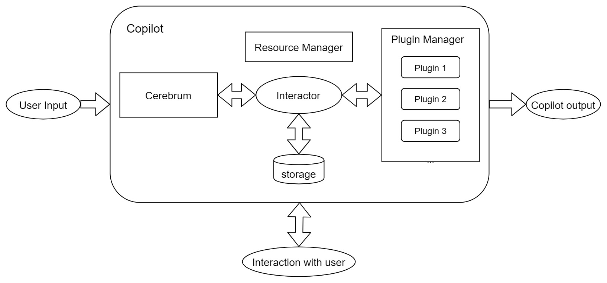

# ConCopilot Framework

The figure below shows the high level framework of ConCopilot.

The `Copilot` interface is the boundary of an APP, which takes inputs, does user interaction, and finally gives outputs.

The main interaction progresses, however, are dealt by the `Interactor` interface,
leaving only the framework structure, the workflow initialization/finalization to the `Copilot` interface.
That's why in most cases, developers do not have to implement the `Copilot` interface, just use the default one,
and implement the `Interactor` interface instead for their own interaction logics.

The `ResourceManager` interface manages all resources, make sure they are well initialized and finalized,
so that all plugins are able to access them.
Plugins can only access those resources that have been registered in both the `Plugin` and `ResourceManager` "config.yaml".
This makes the resource access safer that the user can directly see what resources have been passed to their plugins.

The `PluginManager` interface manages all plugins, and also take the responsibility to initialize plugin prompts for LLM.

The `Cerebrum` interface is in charge of interactions with LLM.
It calls LLM with all current materials, including the chat history and assets,
and return the LLM response to the `Interactor` to make a decision for the following work.
It also takes in charge of transferring task materials to LLM chat messages without expose any LLM related configs to the `Interactor`.
This results that any copilot can easily change its backed LLM by substituting its `Cerebrum`.

The `Storage` interface is responsible to storage the long term memory and necessary materials for a copilot.

The `UserInteractor` interface deals with interaction with users.

All interfaces described above are implementd the `Plugin` interface and are regarded as [_Special Plugins_](special_plugins.md).

All components in ConCopilot can interact with each other by using `Messages` which maximum the flexibility of the framework.
We also do not contradict exposing the lower level component methods for deterministic logics.
See our [examples](https://github.com/ConCopilot/concopilot/tree/v0.0.0/concopilot_examples) for details.
